---

### 💻 About Me

- 🐧 Daily driver: **Linux (Ubuntu)** on **Niri/Wayland**, typesetting with **Typst**
- 🧮 Beyond code: academic mathematics, logic and probability modeling - I like applying structural/mathematical thinking to real-world systems
- 🎲 Also deep into tabletop RPG design - building rule systems and the tooling to typeset/manage them
- 🛠️ Building personal tools on the side: TUI dashboards and small automation utilities for my own workflow
- 🏢 Most of my Go/Bubble Tea open-source work lives under the **TAbelhaDev** org - [github.com/TAbelhaDev](https://github.com/TAbelhaDev)
- 📫 Reach me at **ianptkcs@gmail.com**

---

### 🏢 Organizations

**[TAbelhaDev](https://github.com/TAbelhaDev)** - My open-source org. It hosts the shared web design system [tabelhawebui](https://github.com/TAbelhaDev/tabelhawebui), the Bubble Tea TUI library [tabelhatuiui](https://github.com/TAbelhaDev/tabelhatuiui) and the scaffolding CLI [tabelhascaffold](https://github.com/TAbelhaDev/tabelhascaffold) that agree on a common structure, plus the family: [tabelharadar](https://github.com/TAbelhaDev/tabelharadar), [tabelhakanban](https://github.com/TAbelhaDev/tabelhakanban), [tabelhacal](https://github.com/TAbelhaDev/tabelhacal), [tabelhaos](https://github.com/TAbelhaDev/tabelhaos), [tabelhaedu](https://github.com/TAbelhaDev/tabelhaedu), [tabelhafin](https://github.com/TAbelhaDev/tabelhafin) and [tabelhargdk](https://github.com/TAbelhaDev/tabelhargdk).

**[CNPq](https://github.com/cnpq)** - Conselho Nacional de Desenvolvimento Cientifico e Tecnologico. Contributing to open-source scientific computing and research tooling.

---

### 💼 Experience

**[Ensino Agil](https://ensinoagil.com.br)** - ed-tech platform (exams, question banks, student PWA)
- Full-stack: Angular/TypeScript frontend + Django backend, multi-tenant architecture, Firebase
- Checkout & subscription flows, including a dedicated FastAPI/PostgreSQL/Redis microservice with payment gateway integration
- Auth/role-permission systems and native Android/iOS app packaging (WebView shells) for white-label clients

**[WIV](https://wiv.com.br/)** - Blip, a conversational/chatbot platform
- Plugins integrating the platform with third-party CRM & marketing tools, plus internal browser extensions
- Maintain an SDK (pnpm monorepo) including an MCP server package for AI-agent tooling
- Built chat-commerce (SvelteKit + Hono/Drizzle) and app-marketplace (SvelteKit + Hono) products for the platform

---

### 🚀 Featured Projects

| Project | Stack | What it does |
|---|---|---|
| [tabelhacal](https://github.com/TAbelhaDev/tabelhacal) | SvelteKit · Cloudflare · LLM | Natural-language AI calendar assistant with automatic cost tracking |
| [tabelhawebui](https://github.com/TAbelhaDev/tabelhawebui) | Svelte 5 · TypeScript | Shared design system (Catppuccin) + component library for my web apps |
| [tabelhatuiui](https://github.com/TAbelhaDev/tabelhatuiui) | Go · Bubbletea | Shared chrome, layout helpers and the `ipc` convention powering my TUIs |
| [Dank Jobs](https://github.com/ianptkcs/dankjobs) | Go · Bubbletea | TUI to browse/manage jobs scheduled as systemd user timers |
| [tabelharadar](https://github.com/TAbelhaDev/tabelharadar) | Go · Bubbletea | TUI to monitor local repo git health: WIP, unmerged/unpushed work, missing remotes |
| [tabelhakanban](https://github.com/TAbelhaDev/tabelhakanban) | Go · Bubbletea | Kanban TUI over plain markdown files - each card is a .md, each column a folder |
| [tabelhaos](https://github.com/TAbelhaDev/tabelhaos) | Bash · archiso | Arch Linux migration installer, tested in QEMU with a bootable ISO |
| [tabelhascaffold](https://github.com/TAbelhaDev/tabelhascaffold) | Go · CLI | Injects CI/release workflows, issue/PR templates, CONTRIBUTING, LICENSE, CHANGELOG and badges into new Go repos |
| [C-MAPSS RUL](https://github.com/ianptkcs/cmapss-rul) | Python · scikit-learn | Remaining Useful Life prediction for NASA C-MAPSS turbofan engines (Random Forest baseline) |
| [CPDQ ENEM](https://github.com/ianptkcs/cpdq) | Python · Typst | ENEM math analysis (2018-2025) + didactic-material generator for a prep entrance-exam course |

> 🎲 **Currently building (hobby):** the *TAbelhaRPGDK* tabletop RPG - a Typst-typeset rulebook system with custom class archetypes, a rules engine, and a companion web platform for character/campaign management.

---

### 🛠️ Languages & Toolbox

 

---

### 📊 GitHub Stats

---

### 🏆 Trophies

---

### 📫 Connect with me

  
  
  
  

